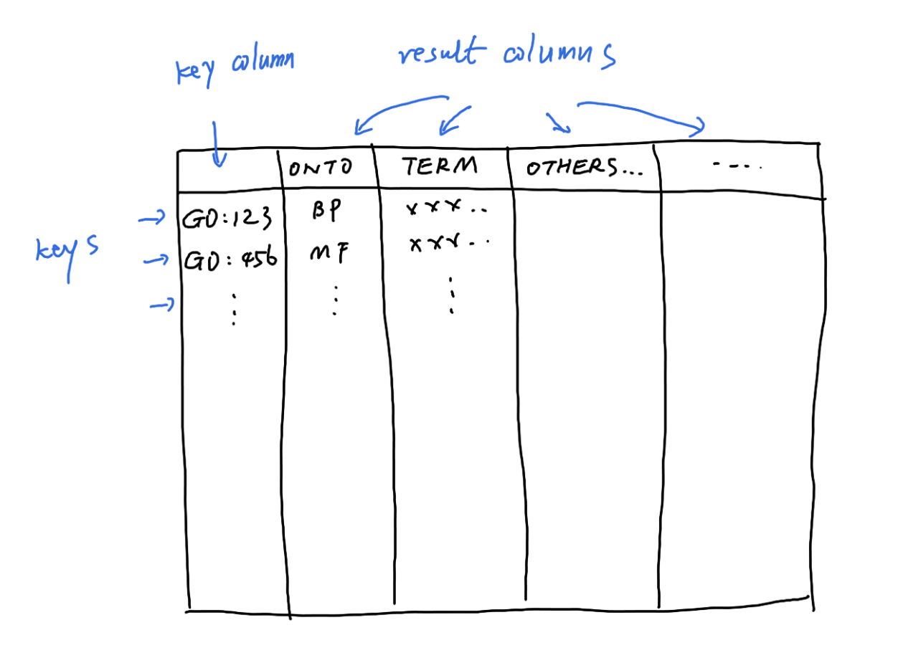

### The GO.db package

The first package I will introduce is the **GO.db** package. It is maintained
by the Bioconductor core team and it is frequently updated in every
Bioconductor release. Thus, it always stores up-to-date data for GO and it can
be treated as the standard source to read and process GO data in R. **GO.db**
contains detailed information of GO terms as well as the hierarchical
structure of the GO tree. The data in **GO.db** is only focused on GO terms
and their relations, and it is independent to specific organisms.

First let's load the **GO.db** package.

```{r, message = FALSE}
library(GO.db)
```

#### use GO.db as a database object

**GO.db** is constructed by the low-level package **AnnotationDbi**, which
defines a general database interface for storing and precessing biological
annotation data. Internally the GO data is represented as an SQLite database
with multiple tables. A large number of low-level functions defined in
**AnnotationDbi** can be applied to the objects in **GO.db** to get customized
filtering on GO data. Expericenced readers may go to the documentation of
**AnnotationDbi** for more information.

Simply printing the object `GO.db` shows the basic information of the package.
The two most important fields are the source file (`GOSOURCEURL`) and the date
(`GOSOURCEDATE`) to build the package, which tell you the version of the GO data.

```{r}
GO.db
```

`GO.db` is a database object created by **AnnotationDbi**, thus, the general
method `select()` can be applied to retrieve the data by specifying a vector
of "keys" which is a list of GO IDs, and a group of "columns" which are the
fields where the values are retrieved. In the following code, we extract the
values of `"ONTOLOGY"` and `"TERM"` for two GO IDs. 

```{r}
select(GO.db, keys = c("GO:0000001", "GO:0000002"), 
    columns = c("ONTOLOGY", "TERM"))
```

It can be read as "imagine `GO.db` is a table, select values in columns of 'ONTOLOGY' and 'TERM' where values
in the primary column (GO_ID) are 'GO:0000001' and 'GO:0000002'".

The valid columns names can be obtained by `columns(GO.db)`.

```{r}
columns(GO.db)
```



#### Objects in GO.db

However, we don't really need to use the low-level function `select()` to
retrieve the data. In **GO.db**, there are several tables that have already
been compiled and can be used directly. These tables are represented as
objects in the package. The following command prints all the variables that
are exported in **GO.db**. Note, in the interactive R terminal, users can also
see the variables by typing `GO.db::` with two continuous tabs.

```{r, echo = FALSE}
ls = function(x, ...) {
    setdiff(base::ls(x, ...), "datacache")
}
```

```{r, echo = 1}
ls(envir = asNamespace("GO.db"))
```


Before I introduce the GO-related objects, I first briefly introduce the
following four functions `GO_dbInfo()`, `GO_dbconn()`, `GO_dbfile()` and
`GO_dbschema()` in **GO.db**. These four functions can be executed without
argument. They provides information of the database, e.g., `GO_dbfile()`
returns the path of the database file.

```{r}
GO_dbfile()
```

If readers are interested, they can use external tools to view the `GO.sqlite`
file to see the internal representation of the database tables. However, for
other readers, the internal representation of data is less important.
**GO.db** provides an easy interface for processing the GO data, convert it into data
frames or lists.

#### GOTERM

First let's look at the variable `GOTERM`. It contains basic information of
every individual GO term, such as GO ID, the namespace and the definition.

```{r}
GOTERM
```

`GOTERM` is an object of class `GOTermsAnnDbBimap`, which is a child class of
a more general class `Bimap` defined in `AnnotationDbi`. Thus, many low-level
functions defined in **AnnotationDbi** can be applied to `GOTERM` (see the
documentation of `Bimap`). However, as suggested in the documentation of
`GOTERM`, we do not need to directly work with these low-level classes, while
we just simply convert it to a list.

```{r}
gl = as.list(GOTERM)
```

Now `gl` is a normal list of GO terms. We can check the total number of GO
terms in current version of **GO.db** (Actually the number of all GO terms is `r length(gl) - 1`.
Later in this section I will show you there is an additional pseudo term in `GOTERM`.).

```{r}
length(gl)
```

We can get a single GO term by specifying the index.

```{r}
term = gl[[1]]  ## also gl[["GO:0000001"]]
term
```

The output after printing `term` includes several fields and the corresponding
values. Although `gl` is a normal list, its elements are still in a special
class `GOTerms` (try typing `class(term)`). The `GOTerms` class is a simple class for storing 
information of individual GO terms. There are several "getter"
functions to extract values in the corresponding fields. The most important
functions are `GOID()`, `Term()`, `Ontology()`, and `Definition()`. Other information
on the `GOTerms` function can be found from its documentation by `?GOTerms`.

```{r}
GOID(term)
Term(term)
Ontology(term)
Definition(term)
```

Then, to get the namespaces of all GO terms, we can do:

```{r}
ol = sapply(gl, Ontology)
head(ol)
```

Besides working on individual GO terms, the getter functions can be directly applied
on the global `GOTERM` object to extract information of all
GO terms simultaneously.

```{r all_go}
head(GOID(GOTERM))
head(Ontology(GOTERM))
```

Now let's go back to the object `GOTERM`. It stores data for all GO terms, so
essentially it is a list of elements in a certain format. `GOTERM` or its
class `GOTermsAnnDbBimap` allows subsetting to obtain a subset of GO terms.
There are two types of subset operators: single bracket `[` and double
brackets `[[` and they have different behaviors.

Similar as the subset operators for list, the single bracket `[` returns a
subset of data but still keeps the original format. Both numeric and character
indices are allowed, but more often, character indices as GO IDs are used.

```{r}
# note you can also use numeric indices
GOTERM[c("GO:0000001", "GO:0000002", "GO:0000003")]
``` 

So, if you want to get information of a subset of GO terms, you can do like:

```{r}
go_id = c("GO:0000001", "GO:0000002", "GO:0000003")
Ontology(GOTERM[go_id])
``` 

The double-bracket operator `[[` is different. It degenerates the original
format and directly extracts the element in it. Note here only a single
character index is allows:

```{r}
# note numeric index is not allowed
GOTERM[["GO:0000001"]]
```

This behaves the same as `gl[["GO::0000001"]]`.

We can calculate some simple statistics on the GO terms, such as the number of terms
under each GO namespace. Directly applying `Ontology()` on `GOTERM`, it is easy to count number of GO
terms in each namespace.

```{r}
table(Ontology(GOTERM))
```

Interestingly, besides the three namespaces `"BP"`, `"CC"` and `"MF"`, there
is an additionally namespace `"universal"` that only contains one term. As
mentioned before, the three GO namespaces are isolateted. However, some tools
may require all GO terms are connected if the relations are represented as a
graph. Thus, one pseudo "universal root term" is added as the parent of root
nodes in the three namespaces. In **GO.db**, this special term has an ID
`"all"`.

```{r}
which(Ontology(GOTERM) == "universal")
GOTERM[["all"]]
```

#### Term relations in GO.db

**GO.db** also provides variables that contains relations between GO terms.
Taking biological process namespace as an example, there are the following
four variables (similar for other two namespaces, but with `GOCC` and `GOMF`
prefix).

- `GOBPCHILDREN`
- `GOBPPARENTS`
- `GOBPOFFSPRING`
- `GOBPANCESTOR`


`GOBPCHILDREN` and `GOBPPARENTS` contain parent-child relations.
`GOBPOFFSPRING` contains all offspring terms of GO terms (i.e., all downstream
terms of a term in the GO tree) and `GOBPANCESTOR` contais all ancestor terms
of a GO term (i.e., all upstream terms of a term). The information in the four
variables are actually redudant, e.g., all the other three objects can be
constructed from `GOBPCHILDREN`. However, these pre-computated objects will
save time in downstream analysis because traversing the GO tree is
time-consuming.

The four variables are in the same format (objects of the `AnnDbBimap` class, also inherts from the `Bimap` class).
Taking `GOBPCHILDREN` as an example, we directly convert it to a list.

```{r}
lt = as.list(GOBPCHILDREN)
head(lt)
```

`lt` is a simple list of vectors where each vector are child terms of a
specific GO term, e.g., `GO:0000002` has a child term `GO:0032042`. The
element vectors in `lt` are also named and the names represent the relation of
the child term to the parent term. When the element vector has a value `NA`,
e.g. `GO::0000001`, this means the GO term is a leaf in the GO tree, and it
has no child term.

Some downstream analysis, e.g., network analysis, may expect the relations to
be represented as two columns. In this case, we can use the general function
`toTable()` defined in **AnnotationDbi** to convert `GOBPCHILDREN` to a data
frame (`toTable()` can also be applied to `GOTERM`. Readers can try to see what is the output from  `toTable(GOTERM)`.).

```{r}
tb = toTable(GOBPCHILDREN)
head(tb)
```

Unfortunately, the first two columns in `tb` have the same name. A good idea
is to add meaningful column names to it.

```{r}
colnames(tb)[1:2] = c("child", "parent")
```

Please note, the previous column names are only valid for `GOBPCHILDREN`. If it is from 
one of the three `GOBP*` objects, readers please inspect the output to determine proper column names for it.

With `tb`, we can calculate the fraction of different relations of GO terms.

```{r}
tb = toTable(GOBPCHILDREN)
table(tb[, 3])
```

Note, only `GOBPPARENTS` and `GOBPANCESTOR` contain the universal root term `"all"`.

```{r}
lt = as.list(GOBPPARENTS)
lt[["GO:0008150"]]  # GO:0008150 is "biological process"
```

We can look at the distribution of the number of GO terms in each object.

1. Number of child terms. This is also the out-degree distribution if thinking the GO tree as a graph. The following plot shows the out-degree follows a power-law distribution.

```{r}
lt = as.list(GOBPCHILDREN)
tb = table(sapply(lt, length))
x = as.numeric(names(tb))
y = as.vector(tb)

library(ggplot2)
ggplot(data.frame(x = x, y = y), aes(x = x, y = y)) +
    geom_point() +
    scale_x_continuous(trans='log10') +
    scale_y_continuous(trans='log10') +
    labs(x = "Number of child terms", y = "Counts") + ggtitle("GOBPCHILDREN")
```

2. Number of parent terms. The term "GO:0008150" (biological process) is removed from the analysis because it is the top node in BP namespace and it has no parent term.

```{r}
lt = as.list(GOBPPARENTS)
lt = lt[names(lt) != "GO:0008150"]
tb = table(sapply(lt, length))
x = as.numeric(names(tb))
y = as.vector(tb)

ggplot(data.frame(x = x, y = y), aes(x = x, y = y)) +
    geom_point() +
    scale_y_continuous(trans='log10') +
    labs(x = "Number of parent terms", y = "Counts") + ggtitle("GOBOPARENTS")
```

3. Number of offspring terms. It also follows a power-law distribution.

```{r}
lt = as.list(GOBPOFFSPRING)
tb = table(sapply(lt, length))
x = as.numeric(names(tb))
y = as.vector(tb)

ggplot(data.frame(x = x, y = y), aes(x = x, y = y)) +
    geom_point() +
    scale_x_continuous(trans='log10') +
    scale_y_continuous(trans='log10') +
    labs(x = "Number of offspring terms", y = "Counts") + ggtitle("GOBPOFFSPRING")
```

4. Number of ancestor terms. This can be approximated as from a Possion distribution.

```{r}
lt = as.list(GOBPANCESTOR)
lt = lt[names(lt) != "GO:0008150"]
lt = lapply(lt, function(x) setdiff(x, "all"))
tb = table(sapply(lt, length))
x = as.numeric(names(tb))
y = as.vector(tb)

ggplot(data.frame(x = x, y = y), aes(x = x, y = y)) +
    geom_point() +
    scale_y_continuous(trans='log10') +
    labs(x = "Number of ancestor terms", y = "Counts") + ggtitle("GOBPANCESTOR")
```

#### Graph analysis of GO tree

Relations in `GOBPCHILDREN` or `GOBPPARENTS` can be used to construct
the GO tree as a "graph" or a "netowrk" object. In the remaining part of this section, I will
demonstrate some explorary analysis to show interesting attributes of
the GO graph.

Remember `toTable()` returns the relations between GO terms as a data
frame, thus, it can be used as "edge list" (or adjacency list). In the
following code, we use **igraph** package for network analysis. The
function `graph.edgelist()` construct a graph object from a two-column
matrix where the first column is the source of the link and the second
column is the target of the link.

```{r}
library(igraph)
tb = toTable(GOBPCHILDREN)
g = graph.edgelist(as.matrix(tb[, 2:1]))
g
```

We can extract GO term with the highest in-degree. This is the term with the largest number of parents. This value can also be get from `GOBPPARENTS`.
Please note `which.max()` only returns one index of the max value, but it does not mean it is the only max value.


```{r}
d = degree(g, mode = "in")
d_in = d[which.max(d)]
d_in
GOTERM[[ names(d_in) ]]
```

We can calculate GO term with the highest out-degree. This is the term with the largest number of children. This value can also be get from `GOBPCHILDREN`.

```{r}
d = degree(g, mode = "out")
d_out = d[which.max(d)]
d_out
GOTERM[[ names(d_out) ]]
```

We can explore some long-disatnce attributes, such as the distance from the root term to every term in the namespace.
The distance can be thought as the depth of a term in the GO tree.


```{r}
dist = distances(g, v = "GO:0008150", mode = "out")
table(dist)
```

We can also extract the longest path from the root term to the leaf terms.

```{r}
d = degree(g, mode = "out")
leave = names(d[d == 0])
sp = shortest_paths(g, from = "GO:0008150", to = leave, mode = "out")
i = which.max(sapply(sp$vpath, length))
path = sp$vpath[[i]]
Term(GOTERM[names(path)])
```


### Link GO terms to genes

As introduced in the previous section, **GO.db** only contains information for GO terms.
GO also provides gene annotated to GO terms, by manual curation or computation prediction.
Such annotations are represented as mappings between GO IDs and gene IDs from external databases,
which are usually synchronized between major public databases such NCBI.

#### org.Hs.eg.db

To obtains genes in each GO term in R, Bioconductor provides a family of packages with name of
**org.\*.db**. Let's take human for example, the corresponding package is **org.Hs.eg.db**.
**org.Hs.eg.db** provides a standard way
to provide mappings from Entrez gene IDs to a variaty of other databases. 

```{r}
library(org.Hs.eg.db)
```

In this package, there are two database table objects for mapping between GO IDs and genes:

- `org.Hs.egGO2EG`
- `org.Hs.egGO2ALLEGS`

The difference between the two objects is `org.Hs.egGO2EG` contains genes that
are *directly annotated* to every GO term, while `org.Hs.egGO2ALLEGS` contains
genes that directly assigned to the GO term, *as well as* genes assigned to
all its ancestor terms. For example if term A is a parent of term B where A is more general,
genes with function B should also have function A. Thus `org.Hs.egGO2ALLEGS` is
the proper object for GO gene sets.

Again, `org.Hs.egGO2ALLEGS` is a database object. There are two ways to obtain gene annotations to GO terms. The first is to 
convert `org.Hs.egGO2ALLEGS` to a list of gene vectors.

```{r}
lt = as.list(org.Hs.egGO2ALLEGS)
lt[3:4] # lt[[2]] is too long to print
```

In this case, each element vector actually is a GO gene set. Note here the genes are in Entrez IDs, which are digits
but in character mode. Node this is important to save the Gene IDs explicitely as characters to get rid of potential error
due to indexing. We will emphasize it again in later text.

The gene IDs have names. They are evidence of annotating genes to GO terms.

`org.Hs.egGO2ALLEGS` is a database object (also inherts from the `Bimap` class), thus `toTable()` can be directly applied to convert it as a table.

```{r}
tb = toTable(org.Hs.egGO2ALLEGS)
head(tb)
```

Now there is an additional column `"Ontology"`. This is convinient because `org.Hs.egGO2ALLEGS`
contains GO terms from the three namespaces and the `as.list()` cannot distinguish the different namespaces.

With `tb`, we can look at the distribution of number of genes in GO gene sets. It approximately follows a power-law distribution.

```{r}
tb = tb[tb$Ontology == "BP", ]
t1 = table(table(tb$go_id))
x1 = as.numeric(names(t1))
y1 = as.vector(t1)
ggplot(data.frame(x = x1, y = y1), aes(x = x, y = y)) +
    geom_point() +
    scale_x_continuous(trans='log10') +
    scale_y_continuous(trans='log10') +
    labs(x = "Number of annotated genes", y = "Counts") + ggtitle("GOBP")
```

And the distribution of number of GO gene sets that a gene is in.

```{r}
t2 = table(table(tb$gene_id))
x2 = as.numeric(names(t2))
y2 = as.vector(t2)
ggplot(data.frame(x = x2, y = y2), aes(x = x, y = y)) +
    geom_point() +
    scale_x_continuous(trans='log10') +
    scale_y_continuous(trans='log10') +
    labs(x = "Number of gene sets", y = "Counts") + ggtitle("GOBP")
```

Biocondutor core team maintaines **org.\*.db** for 18 organisms

```{r, echo = FALSE}
tb = read.table(textConnection(
"org.Hs.eg.db    Human   org.Ss.eg.db    Pig
org.Mm.eg.db    Mouse   org.Gg.eg.db    Chicken
org.Rn.eg.db    Rat org.Mmu.eg.db   Rhesus_monkey
org.Dm.eg.db    Fruit_fly   org.Cf.eg.db    Canine
org.At.tair.db  Arabidopsis org.EcK12.eg.db E_coli_strain_K12
org.Sc.sgd.db   Yeast   org.Xl.eg.db    African_clawed_frog
org.Dr.eg.db    Zebrafish   org.Ag.eg.db    Malaria_mosquito
org.Ce.eg.db    Nematode    org.Pt.eg.db    Chimpanzee
org.Bt.eg.db    Bovine  org.EcSakai.eg.db   E_coli_strain_Sakai
"))
```

```{r, echo = FALSE}
tb[, 1] = paste0("`", tb[, 1], "`")
tb[, 3] = paste0("`", tb[, 3], "`")
tb[, 2] = gsub("_", " ", tb[, 2])
tb[, 4] = gsub("_", " ", tb[, 4])
knitr::kable(tb, col.names = c("Package", "Organism", "Package", "Organism"))
```
