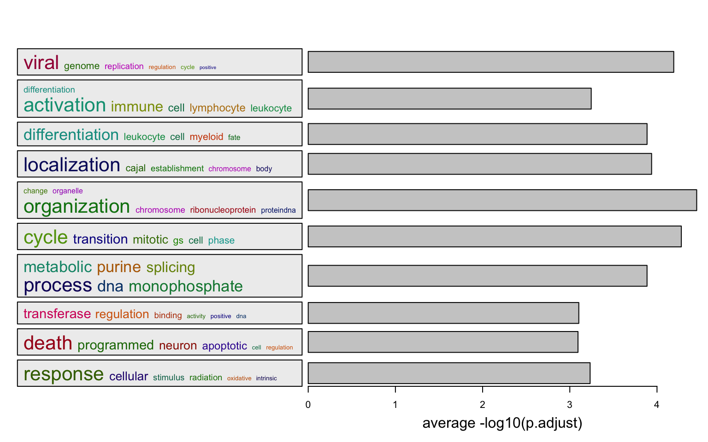
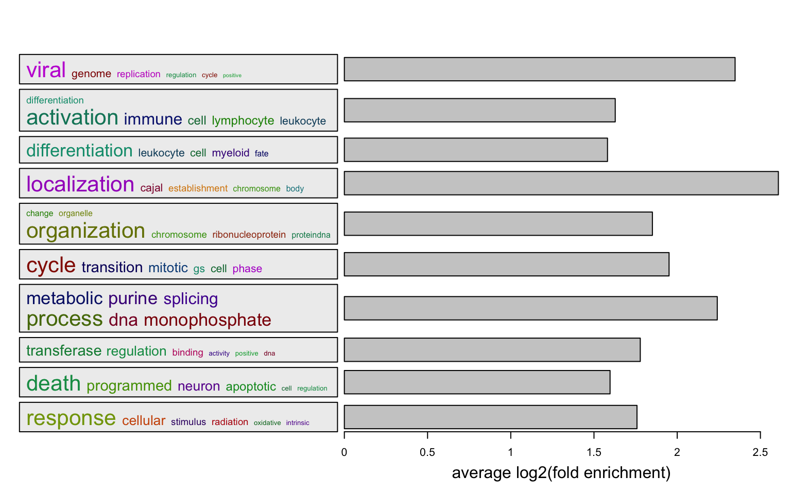

```{r}
library(GSEAtraining)
```

**simplifyEnrichment** is suggested to work on GO enrichment results.

## A vector of GO IDs

```{r, echo = FALSE}
library(simplifyEnrichment)
se_opt$verbose = FALSE
```

```{r, fig.width = 8, fig.height = 4.5}
library(simplifyEnrichment)
set.seed(888)
go_id = random_GO(500)
df = simplifyGO(go_id)
table(df)
```

## Multiple enrichment results

We have some signature genes. They can be clustered into four groups with
their expression profile. We apply GO enrichment on the four gene lists and we have
four enrichment tables.

```{r, echo = FALSE, message = FALSE, fig.width = 8, fig.height = 7}
library(cola)
data(golub_cola) 
res = golub_cola["ATC:skmeans"]
get_signatures(res, k = 3)
```

```{r}
lt = readRDS(system.file("extdata", "lt_enrichment_tables.rds"))
length(lt)
head(lt[[1]])
```

`simplifyGOFromMultipleLists()` can visualize GO enrichment from multiple results.

```{r, fig.width = 10, fig.height = 6, eval = FALSE}
simplifyGOFromMultipleLists(lt, padj_cutoff = 0.001)
```


## Word clouds

Let's say, for the following plot, the heatmap is might be necessary to put into the final report.

```{r, fig.width = 8, fig.height = 4.5, eval = FALSE}
df = lt[[1]]
go_id = df$ID[df$p.adjust < 0.01]
simplifyGO(go_id)
```


`summarizeGO()` makes an even simpler plot with word cloud and simply statistical graphics.

Two inputs for the function:

- A vector of GO IDs
- A numeric vector of corresponding statistics

```{r, fig.width = 8, fig.height = 5, eval = FALSE}
l = df$p.adjust < 0.01
summarizeGO(df$ID[l], -log10(df$p.adjust)[l], axis_label = "average -log10(p.adjust)")
```




Or visualize average log2 fold enrichment:

```{r, fig.width = 8, fig.height = 5, eval = FALSE}
l = df$p.adjust < 0.01
summarizeGO(df$ID[l], df$log2_fold_enrichment[l], axis_label = "average log2(fold enrichment)")
```




`summarizeGO()` also supports multiple enrichment results. In this case, `value` should be 
 is a list of numeric named vectors which contains significant GO terms in each enrichment table.

```{r, fig.width = 8, fig.height = 7, eval = FALSE}
value = lapply(lt, function(df) {
    v = -log10(df$p.adjust)
    names(v) = df$ID
    v[df$p.adjust < 0.001]
})
summarizeGO(value = value, axis_label = "average -log10(p.adjust)", 
    legend_title = "-log10(p.adjust)")
```


Or use log2 fold enrichment:

```{r, fig.width = 8, fig.height = 7, eval = FALSE}
value = lapply(lt, function(df) {
    v = df$log2_fold_enrichment
    names(v) = df$ID
    v[df$p.adjust < 0.001]
})
summarizeGO(value = value, axis_label = "average log2_fold_enrichment", 
    legend_title = "log2(fold_enrichment)")
```


